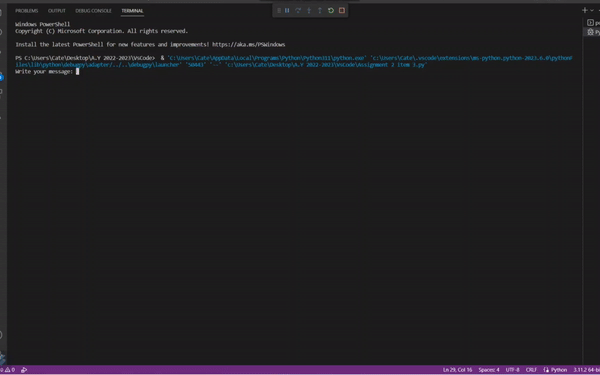

# Vigenere Cipher
This is a python program that asks the user for the plaintext (all uppercase letters, no spaces) and the keyword (all uppercase letters) and produce the ciphertext using the Vigenère cipher.




# Needed Packages to Install
Asciimatics

Asciimatics is a package to help people create full-screen text UIs (from interactive forms to ASCII animations) on any platform. It is licensed under the Apache Software Foundation License 2.0. It provides a single cross-platform Python class to do all the low-level console function you could ask for, including:

-Coloured/styled text - including 256 colour terminals and unicode characters (even CJK languages)

-Cursor positioning

-Keyboard input (without blocking or echoing) including unicode support

-Mouse input (terminal permitting)

-Detecting and handling when the console resizes

-Screen scraping


In addition, it provides some simple, high-level APIs to provide more complex features including:

-Anti-aliased ASCII line-drawing

-Image to ASCII conversion - including JPEG and GIF formats

-Many animation effects - e.g. sprites, particle systems, banners, etc.

-Various widgets for text UIs - e.g. buttons, text boxes, radio buttons, etc.

# Installation of Packages
Asciimatics supports Python version 3. For the precise list of tested versions, refer to pypi. The last version of asciimatics to support Python 2 is v1.14.

To install asciimatics, simply install with pip as follows:
```
pip install asciimatics
```
